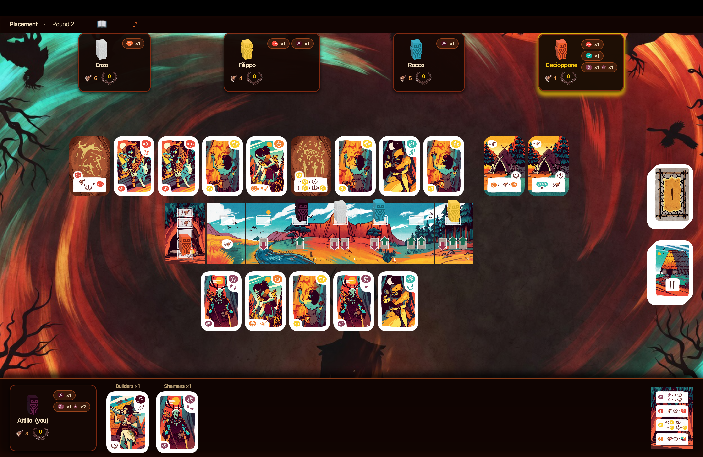
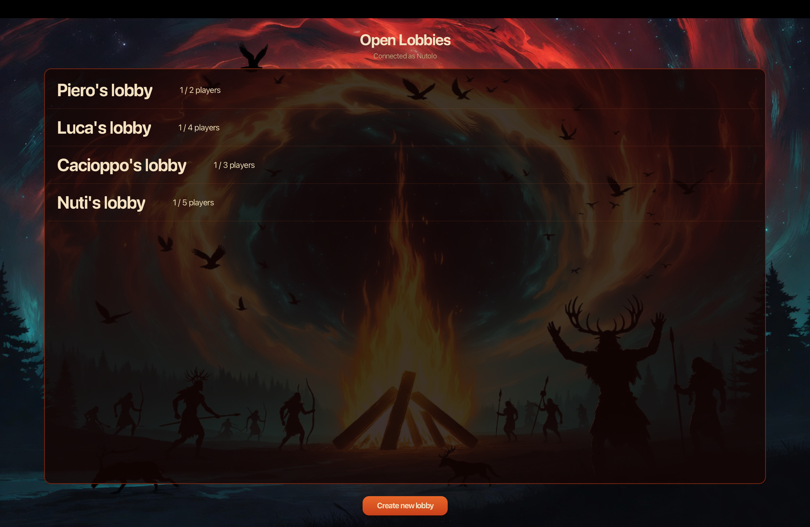

# Mesos — Software Engineering Final Project

  

A distributed, client-server implementation of the **Mesos** board game, developed as the
**Software Engineering final project** (Prova Finale di Ingegneria del Software) at **Politecnico di Milano**, 2026.



## Features

- **Complete game rules**
- **Two clients:** JavaFX GUI and terminal UI (TUI)
- **Two network protocols:** Socket and RMI, abstracted behind a common interface
- **Multiple concurrent games** with a lobby system
- **Resilience to disconnections:** players can reconnect to an ongoing game
- **Persistence:** optional MySQL database for match results

<p align="center"></p>

## Architecture

MVC on the server side, with an asynchronous command flow: client commands are queued
(`BlockingQueue`) and consumed by a lobby thread and one controller thread per game, while
state updates are pushed back to clients through a `VirtualView`.

- [High-level architecture](deliverables/architecture-high-level.png)
- [Sequence diagrams](deliverables/diagrams) — connection, lobby, game flow, disconnection/reconnection, database
- [UML sources](deliverables) and [test coverage](deliverables/coverage)

## Getting started

**Requirements:** Java 21 · MySQL (optional, only for persistence)

```bash
./mvnw clean package -DskipTests   # builds the jars in target/
```

```bash
java -jar target/serverMain.jar      # server
java -jar target/ClientMain.jar      # GUI client
java -jar target/clientMainCLI.jar   # TUI client
```

- The server asks at startup whether to enable the database (default: disabled).
- Clients ask for server host and protocol. Ports: **9999** (Socket), **1099** (RMI).
- To advertise a specific IP for RMI, set `MESOS_HOST` (or `-Dmesos.host=...`).
- **Windows:** run `chcp 65001 > $null;` before the command to avoid terminal encoding issues.
- JavaFX natives are bundled for Windows, Linux and Apple Silicon macOS.

## Testing

```bash
./mvnw test   # JUnit 5 + JaCoCo coverage report in target/site/jacoco
```

## Team

- Pierluca Attilio Primiceri
- [Vincenzo Parente](https://github.com/vincenzoparente04)
- [Filippo Orsijena](https://github.com/Filippo317)
- [Rocco Panizzi](https://github.com/rocco822)

---

<sub>Mesos is a board game by *Cranio Creations*. This is a non-commercial academic project; all rights and images of the original game belong to their respective owners.</sub>
